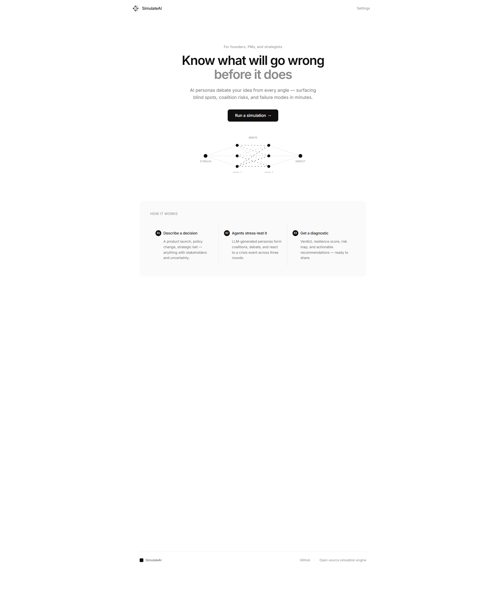
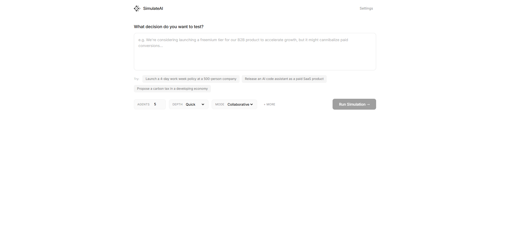

<div align="center">


# SimulateAI

**Know what will go wrong before it does.**

AI personas debate your idea from every angle — surfacing blind spots, coalition risks, and failure modes in minutes.

[](LICENSE)
[](https://python.org)
[](https://react.dev)
[](https://fastapi.tiangolo.com)
[](https://railway.app)

[Live Demo](https://simulate-ai-production.up.railway.app) · [How It Works](#how-it-works) · [Getting Started](#getting-started) · [API Reference](#api-reference)

</div>

---



## What is SimulateAI?

SimulateAI is a multi-agent simulation platform that stress-tests your decisions before you commit to them. Submit any concept — a product pitch, draft policy, research question, or strategic move — and a swarm of AI personas evaluates it through structured debate rounds.

The result: a diagnostic report with a resilience verdict (Fragile / Moderate / Resilient) backed by quantified metrics — not vibes.

### Use cases

- **Founders** — Stress-test a pitch before investor meetings
- **Product managers** — Pressure-test feature decisions from multiple user perspectives
- **Policy makers** — Simulate stakeholder reactions to new regulations
- **Strategists** — Find failure modes in strategic plans before execution

## How It Works

Every simulation runs through five stages:

```
STIMULUS → ARCHITECT → SWARM → 3-ROUND DEBATE → DIAGNOSTIC REPORT
```

1. **Architect** — Analyzes your input and generates a dynamic simulation schema (actions, emotional states, resource models)
2. **Swarm Generation** — Creates N diverse personas aligned to the schema
3. **Round 1: Perception** — Each agent independently evaluates the stimulus
4. **Round 2: Debate** — Agents are paired with adversaries and must engage opposing stances
5. **Round 3: Crisis** — An external shock is synthesized; the swarm re-evaluates under pressure

A compiler then produces a structured diagnostic with a deterministic resilience verdict computed from decision stability, utility drift, and coalition dynamics.



## Getting Started

### Prerequisites

- Python 3.11+
- Node.js 20+ (for frontend development)
- An API key from Google AI Studio, OpenAI, or a running Ollama instance

### Quick Start

```bash
git clone https://github.com/AfiqN/simulate-ai.git
cd simulate-ai
cp .env.example .env        # Add your API key
pip install -r requirements.txt
python server.py            # → http://localhost:8000
```

### Docker

```bash
cp .env.example .env        # Add your API key
docker compose up --build   # → http://localhost:8000
```

### Environment Variables

```bash
# Required: pick one provider
LLM_PROVIDER=gemini              # gemini | openai | ollama

# Provider keys (only your chosen provider needed)
GEMINI_API_KEY=your-key-here
OPENAI_API_KEY=your-key-here
OPENAI_BASE_URL=https://api.openai.com/v1
OLLAMA_HOST=http://localhost:11434

# Optional
MAX_CONCURRENCY=5
RAG_ENABLED=true
BRAVE_API_KEY=                   # Brave Search for RAG enrichment
```

## Supported Providers

| Provider | Config | Notes |
|----------|--------|-------|
| **Google Gemini** | `LLM_PROVIDER=gemini` + `GEMINI_API_KEY` | Free tier available |
| **OpenAI** | `LLM_PROVIDER=openai` + `OPENAI_API_KEY` | GPT-4o recommended |
| **Ollama** | `LLM_PROVIDER=ollama` + `OLLAMA_HOST` | Fully local, no API key needed |

Users can also bring their own API key directly in the web UI — no server-side key required.

## Tech Stack

| Layer | Technology |
|-------|-----------|
| Frontend | React 18, TypeScript, Tailwind CSS, Vite |
| Backend | Python 3.11, FastAPI, asyncio |
| LLM | Multi-provider (Gemini, OpenAI, Ollama) |
| Database | SQLite (aiosqlite) |
| Deploy | Railway, Docker |

## API Reference

### `POST /api/simulate`

Start a new simulation. Returns immediately with a run ID for polling.

```json
{
  "stimulus": "A fintech startup pitching micro-investment accounts to regulators",
  "agent_count": 5,
  "concurrency": 2,
  "provider": "gemini",
  "model": "gemma-4-26b-a4b-it"
}
```

All fields except `stimulus` are optional.

### `GET /api/simulate/{id}`

Poll run status. Returns `queued` | `running` | `completed` | `failed` with full results on completion.

### `GET /api/runs`

List historical runs. Supports `limit`, `offset`, and `verdict` filter params.

### `GET /api/health`

Health check — returns provider and model info.

## CLI Usage

SimulateAI also ships with a full CLI for batch testing and scripting:

```bash
# Interactive mode
python main.py

# Run a predefined scenario
python tests/run_scenario.py fintech

# Run all scenarios
python tests/run_scenario.py --all --parallel 2

# Override provider per-run
python tests/run_scenario.py 01 --provider openai --model gpt-4o
```

<details>
<summary>CLI flags reference</summary>

| Flag | Default | Description |
|------|---------|-------------|
| `scenario` | — | Name fragment, prefix, or path to `.txt` file |
| `--all` | false | Run every scenario in `tests/scenarios/` |
| `--agents N` | 5 | Agent count per scenario |
| `--concurrency N` | 2 | Max simultaneous LLM calls |
| `--parallel N` | 1 | Run N scenarios concurrently |
| `--provider` | env default | `gemini`, `openai`, or `ollama` |
| `--model` | env default | Model name for the provider |
| `--crisis TEXT` | auto | Custom crisis event for Round 3 |

</details>

## Architecture

```
├── server.py              # FastAPI entry point
├── config.py              # Provider configuration
├── src/
│   ├── agent/             # Agent logic (perceive, debate, crisis rounds)
│   ├── api/               # REST endpoints, job queue
│   ├── cli/               # Interactive CLI
│   ├── export/            # Run bundle writer
│   ├── llm/               # Multi-provider LLM client
│   ├── persistence/       # SQLite storage
│   ├── report/            # Diagnostic compiler
│   └── schema/            # Simulation schema architect
├── frontend/              # React + Vite SPA
│   ├── src/components/    # UI components
│   └── public/            # Static assets
└── tests/
    ├── scenarios/         # Predefined stimuli
    └── unit/              # Deterministic helper tests
```

## Development

```bash
# Backend
pip install -r requirements.txt
python server.py --reload

# Frontend
cd frontend
npm install
npm run dev                # → http://localhost:5173
```

### Running Tests

```bash
python -m pytest tests/unit/ -v
```

## Deployment

SimulateAI is deployed on Railway. The server serves both the API and the pre-built frontend from `static/dist/`.

```bash
# Build frontend for production
cd frontend && npm run build    # outputs to ../static/dist/

# Start production server
python server.py
```

## Contributing

Contributions are welcome. Please:

1. Fork the repo
2. Create a feature branch (`git checkout -b feat/your-feature`)
3. Commit your changes
4. Push and open a Pull Request

For bugs, please open an issue with steps to reproduce.

## License

[MIT](LICENSE) © AfiqN
